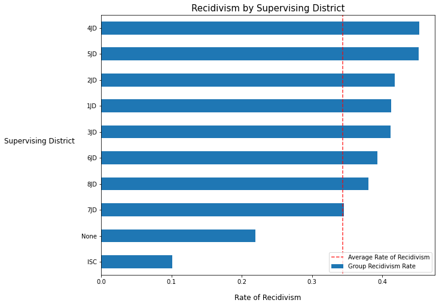
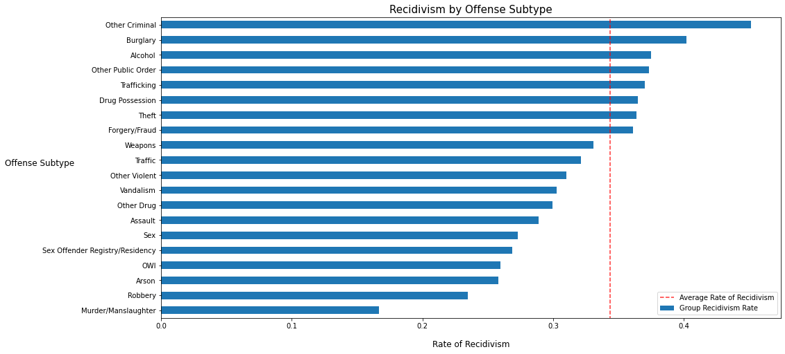
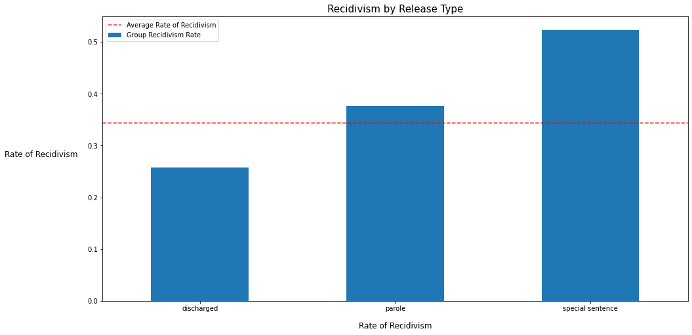
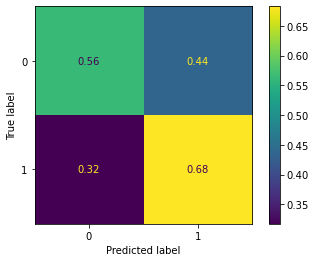

# Modeling Recidivism in Iowa

Flatiron School Phase 3 Data Science Project
Author: Robert Harrow

## Overview

<figure>

<figcaption align = "center"><b>Photo by Larry Farr on Unsplash</b></figcaption>
</figure>
<br>

The stakeholder for this analysis is the Iowa Department of Corrections (IDC). The IDC wants to better understand factors that may lead to recidivism and to have a model that can help predict whether a person is at risk of reoffending.

## Business Understanding

The Department of Corrections uses recidivism as an indicator on whether strategies are reducing offenders relapse into criminal behavior. It wants to use analysis to pin-point whether current strategies are failing certain populations or groups at disproportionate rates so it can better study what is or isn't working.

## Data & Methodology

To study recidivism, the IDC maintains a database of prisoner recidivism. The file contains 17 features, and over 26,000 records - each pertaining to a given prisoner between 2010 and 2015.

The TARGET column was 'Return to Prison', which indicates whether the prisoner returned to prison within 3 years of release. Below is a dictionary explaining the data.

Here is how the data is distributed

| Class = 'Return to Prison' | Occurrences | % of Total |
|----------------------------|-------------|------------|
| Yes (1)                    | 8681        | 35%        |
| No (0)                     | 17339       | 65%        |

From the IDC:

"This dataset reports whether an offender is re-admitted to prison or not within three years from being released from prison in Iowa. The recidivism reporting year is the fiscal year (year ending June 30) marking the end of the three year tracking period.

The Department of Corrections uses recidivism as an indicator on whether strategies are reducing offenders relapse into criminal behavior. A three year time frame is used as studies have shown if an offender relapses into criminal behavior it is most likely to happen within three years of being released."

### Data Dictionary

| Column Name                | Description                                                                                                                                                                                                          |
|:---------------------------|:---------------------------------------------------------------------------------------------------------------------------------------------------------------------------------------------------------------------|
| Fiscal Year Released       | Fiscal year (year ending June 30) for which the offender was released from prison.                                                                                                                                   |
| Recidivism Reporting Year  | Fiscal year (year ending June 30) that marks the end of the 3-year tracking period. For example, offenders exited prison in FY 2012 are found in recidivism reporting year FY 2015.                                  |
| Main Supervising District  | The Judicial District supervising the offender for the longest time during the tracking period.                                                                                                                      |
| Release Type               | Reasoning for Offender's release from prison.                                                                                                                                                                        |
| Race - Ethnicity           | Offender's Race and Ethnicity                                                                                                                                                                                        |
| Age At Release             | Offender's age group at release from prison.                                                                                                                                                                         |
| Sex                        | Gender of our offender                                                                                                                                                                                               |
| Offense Classification     | Maximum penalties: A Felony = Life; B Felony = 25 or 50 years; C Felony = 10 years; D Felony = 5 years; Aggravated Misdemeanor = 2 years; Serious Misdemeanor = 1 year; Simple Misdemeanor = 30 days                 |
| Offense Type               | General category for the most serious offense for which the offender was placed in prison.                                                                                                                           |
| Offense Subtype            | Further classification of the most serious offense for which the offender was placed in prison.                                                                                                                      |
| Return to Prison           | No = Did not return to prison within the three year tracking period; Yes = Admitted to prison for any reason within the three year tracking period                                                                   |
| Days to Return             | Number of days it took before the offender returned to prison.                                                                                                                                                       |
| Recidivism Type            | Indicates the reason for return to prison.                                                                                                                                                                           |
| New Offense Classification | New conviction maximum penalties: A Felony = Life; B Felony = 25 or 50 years; C Felony = 10 years; D Felony = 5 years; Aggravated Misdemeanor = 2 years; Serious Misdemeanor = 1 year; Simple Misdemeanor = 30 days  |
| New Offense Type           | General category for the new conviction while the offender is out of prison.                                                                                                                                         |
| New Offense Sub Type       | Further classification of the new conviction.                                                                                                                                                                        |
| Target Population          | The Department of Corrections has undertaken specific strategies to reduce recidivism rates for prisoners who are on parole.                                                                                         |


## Results

We found that Supervising Districts, Race and Offense Subtype to be important features in our models.

### Exploring Supervising Districts

Persons released from prison are either released to one of 8 Supervising Districts, discharged completely or discharged out-of-state (to ISC).

If a person was released to Iowa Judicial District 5, this was the second strongest predictor in our model for whether they are more likely to end up back in prison. Many of the other districts were also among the top 10 predictors overall for our model. Quite a stark contrast to the population that is released to no supervising district.

NOTE: While rates look low for persons released to ISC (Interstate Compact) that is potentially misleading. These persons leave Iowa state, and if they return to a prison not located in Iowa, the IDC does not receive data on that.



### Race & Ethnicity

Another strong predictor in the model was whether the person was a Non-Hispanic American Indian or Alaska Native. The IDC should investigate why its current strategies are failing to help this group.

The results for this and other races and ethnicities are shown below.


### Offense Subtype

Persons in prison for certain offense subtypes showed a greater likelihood of having above-average recidivism rates.

* Persons with the 'Other Criminal' classification had the highest rate, and were the third strongest predictor in our model
* This was followed by those who committed Burglary and Alcohol-related crimes.


### Release Type

Finally, the type of release was the 4th strongest predictor. Individuals released on a special sentence had significantly higher rates of recidivism compared to those discharged without special conditions and those discharged on parole.

Special Sentences apply to Class "B" and Class "C" felonies and a definition can be found [here](https://www.legis.iowa.gov/docs/code/903B.1.pdf).




## Models

The models in this project were maximized for macro recall, because the business case centers around trying to predict a specific class and we were willing to tolerate some degree of false positives.

| Model               | Accuracy | Precision | Recall | F1   |
|---------------------|----------|-----------|--------|------|
| Dummy               | 0.66     | 0.33      | 0.5    | 0.40 |
| Decision Tree       | 0.59     | 0.59      | 0.60   | 0.58 |
| Random Forest       | 0.57     | 0.59      | 0.60   | 0.57 |
| XGBoost             | 0.62     | 0.61      | 0.62   | 0.60 |
| Logistic Regression | 0.60     | 0.61      | 0.62   | 0.60 |

### Final Model

Ultimately, the Logistic Regression and XGBoost models performed best on recall. Recall was important because we wanted to maximize our ability to predict a specific class (persons returning to prison) for the business case. We were willing to tolerate some level of false positives. That's why we also paid attention to Precision/F1 scores. Ultimately, we go with LogisticRegression because it had a slightly lower instance of misclassifying 1's as 0's than the XGBoost model (32% vs 33% respectively)

| Model              | Penalty | Class Weight | Transformation/Encoding |
|--------------------|---------|--------------|-------------------------|
| LogisticRegression | 'none'  | 'balanced'   | OneHotEncoder           |



## Conclusions & Next Steps

* Our logistic regression model was able to predict recidivism with a recall score of 0.62
* The model identified that a person's Supervising District, Race - Ethnicity, Offense Subtype and Type of Release were the most predictive features for whether or not they are likely to return to prison
  * **Supervising Districts.** Persons released to Judicial Supervising districts showed higher rates of recidivism than those released without supervision.
  * **Race - Ethnicity.** Non-Hispanic American Indian, Alaska Natives and White persons showed higher rates of recidivism relative to other  races/ethnicities.
  * **Offense Subtype.** Persons comitting "other criminal" crimes had a higher than average likelihood of reoffending.
  * **Release Type.** Individuals released on a special sentence had far higher average recidivism rates than those released on parole or those discharged without parole.
* The Iowa Department of Corrections should investigate why its programs are disproportionately not effective in helping these persons.

### For more information

See the full analysis in the [Jupyter Notebook](https://github.com/robertharrow/modeling-recidivism/blob/main/recidivism-modeling.ipynb) or review this [presentation](https://github.com/robertharrow/modeling-recidivism/blob/main/presentation.pdf).

For additional info, contact Robert Harrow at rharrow928@gmail.com.

### Repository Structure
```
├── data
├── images
├── README.md
├── presentation.pdf
└── recidivism-modeling.ipynb
```