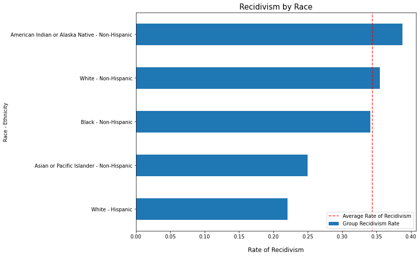

# Modeling Recidivism in Iowa

Phase 3 Project: Robert Harrow

## Overivew

<figure>

<figcaption align = "center"><b>Photo by Larry Farr on Unsplash</b></figcaption>
</figure>

The stakeholder for this analysis is the Iowa Department of Corrections (IDC). The IDC wants to understand whether recidivism among its prison population can be predicted, and if so, what factors serve as the strongest predictors.

The IDC wants to use this information to improve its rehabilitation programs and to understand whether current measures are disproportionately ineffective in helping certain groups.

## Data & Methodology

To study recidivism, the IDC maintains a database of prisoner recidivism. The file contains 17 features, and over 26,000 records - each pertaining to a given prisoner between 2010 and 2015.

A TARGET column was created using the 'Return to Prison' columnm, which indicates whether the prisoner returned to prison within 3 years of release. Below is a dictionary explaining the data.

From the IDC:

"This dataset reports whether an offender is re-admitted to prison or not within three years from being released from prison in Iowa. The recidivism reporting year is the fiscal year (year ending June 30) marking the end of the three year tracking period.

The Department of Corrections uses recidivism as an indicator on whether strategies are reducing offenders relapse into criminal behavior. A three year time frame is used as studies have shown if an offender relapses into criminal behavior it is most likely to happen within three years of being released."

### Data Dictionary

| Column Name                | Description                                                                                                                                                                                                          |
|:---------------------------|:---------------------------------------------------------------------------------------------------------------------------------------------------------------------------------------------------------------------|
| Fiscal Year Released       | Fiscal year (year ending June 30) for which the offender was released from prison.                                                                                                                                   |
| Recidivism Reporting Year  | Fiscal year (year ending June 30) that marks the end of the 3-year tracking period. For example, offenders exited prison in FY 2012 are found in recidivism reporting year FY 2015.                                  |
| Main Supervising District  | The Judicial District supervising the offender for the longest time during the tracking period.                                                                                                                      |
| Release Type               | Reasoning for Offender's release from prison.                                                                                                                                                                        |
| Race - Ethnicity           | Offender's Race and Ethnicity                                                                                                                                                                                        |
| Age At Release             | Offender's age group at release from prison.                                                                                                                                                                         |
| Sex                        | Gender of our offender                                                                                                                                                                                               |
| Offense Classification     | Maximum penalties: A Felony = Life; B Felony = 25 or 50 years; C Felony = 10 years; D Felony = 5 years; Aggravated Misdemeanor = 2 years; Serious Misdemeanor = 1 year; Simple Misdemeanor = 30 days                 |
| Offense Type               | General category for the most serious offense for which the offender was placed in prison.                                                                                                                           |
| Offense Subtype            | Further classification of the most serious offense for which the offender was placed in prison.                                                                                                                      |
| Return to Prison           | No = Did not return to prison within the three year tracking period; Yes = Admitted to prison for any reason within the three year tracking period                                                                   |
| Days to Return             | Number of days it took before the offender returned to prison.                                                                                                                                                       |
| Recidivism Type            | Indicates the reason for return to prison.                                                                                                                                                                           |
| New Offense Classification | New conviction maximum penalties: A Felony = Life; B Felony = 25 or 50 years; C Felony = 10 years; D Felony = 5 years; Aggravated Misdemeanor = 2 years; Serious Misdemeanor = 1 year; Simple Misdemeanor = 30 days  |
| New Offense Type           | General category for the new conviction while the offender is out of prison.                                                                                                                                         |
| New Offense Sub Type       | Further classification of the new conviction.                                                                                                                                                                        |
| Target Population          | The Department of Corrections has undertaken specific strategies to reduce recidivism rates for prisoners who are on parole.                                                                                         |

## Results

We found that Supervising Districts, Race and Age to be important features in our models.

### Exploring Surpervising Districts

Persons released from prison are either released to one of 8 Supervising Districts, discharged completely or discharged out-of-state (to ISC).

NOTE: While rates look low for persons released to ISC (Interstate Compact) that is potentially misleading. These persons leave Iowa state, and if they return to a prison not located in Iowa, the IDC does not receive data on that.

### Race & Ethnicity

Another strong predictor in the model was race & ethnicity. The results are shown below.

### Age at Release

The IDC notes the age of persons at the time they are released from prison. Persons between 25-34 and those below 25 showed higher than average rates of recidivism.

### Release Type

Finally, the type of release was the 4th strongest predictor. Individuals released on a special sentence had significantly higher rates of recidivism compared to those discharged without special conditions and those discharged on parole.

Special Sentences apply to Class "B" and Class "C" felonies and a definition can be found [here](https://www.legis.iowa.gov/docs/code/903B.1.pdf).

## Models

The models in this project were maximizing for macro recall, because the business case centers around trying to predict a specific class and we were willing to tolerate some degree of false positives.

| Model               | Accuracy | Precision | Recall | F1   |
|---------------------|----------|-----------|--------|------|
| Dummy               | 0.66     | 0.33      | 0.5    | 0.40 |
| Decision Tree       | 0.58     | 0.60      | 0.61   | 0.58 |
| Random Forest       | 0.58     | 0.60      | 0.61   | 0.57 |
| XGBoost             | 0.62     | 0.60      | 0.61   | 0.60 |
| Logistic Regression | 0.60     | 0.60      | 0.62   | 0.60 |

### Final Model

Ultimately, the Logistic Regression model performed best on recall. Recall was important because we wanted to maximize our ability to predict a specific class (persons returning to prison) for the business case. We were willing to tolerate some level of false positives. That's why we also paid attention to Precision/F1 scores. Luckily, the best performing LogisticRegression model also scored best on those metrics.

| Model              | Penalty | Class Weight | Transformation/Encoding |
|--------------------|---------|--------------|-------------------------|
| LogisticRegression | 'none'  | 'balanced'   | OneHotEncoder           |

## Conclusions & Next Steps

* Our logistic regression model was able to predict recidivism with a recall score of 0.62
* The model identified that a person's Supervising District, Race - Ethnicity, Age and Type of Release were the most predictive features for whether or not they are likely to return to prison
  * **Supervising Districts.** Persons released to Judicial Supervising districts showed higher rates of recidivism than those released without supervision.
  * **Race - Ethnicity.** Non-Hispanic American Indian, Alaska Natives and White persons showed higher rates of recidivism relative to other races/thnicities.
  * **Age at Release.** Persons below the age of 34 had above-average rates of recidivism.
  * **Release Type.** Individuals released on a special sentence had far higher average recidivism rates than those released on parole or those discharged without parole.
* The Iowa Department of Corrections should investigate why its programs are disproportionately not effective in helping these persons.

### Formore information

See the full analysis in the Jupyter Notebook or review this presentation.

For additional info, contact Robert Harrow at rharrow928@gmail.com.

### Repository Structure

├── data
├── images
├── README.md
├── presentation.pdf
└── recidivism-modeling.ipynb